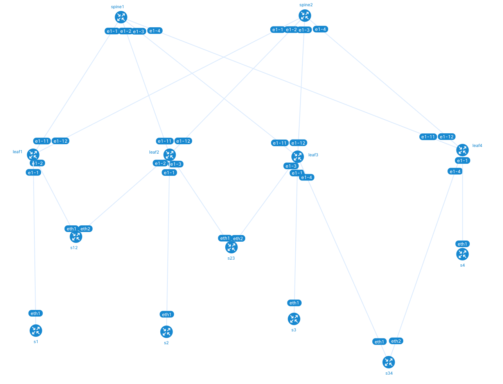

# 3 Stage Clos RFC7938 lab with eBGP in underlay (overlay uses same neighbor)
This is a 3-stage Clos topology following RFC7938 bgp design for large scale DCs.
Config highlights:
- Underlay: dynamic unnumber ebgp peers, ipv4 family
- Overlay: uses the same neighbor/session as the underlay, evpn family.
- MAC-VRF with multi-homing configured on all leaves.
Inter-as-vpn command needed on the spines so that they import evpn routes (even if they have no ip-vrfs) and reflect them to the leaves.

## Configuration

All nodes are preconfigured using the start-up config and the config files that can be found in [`configs`](/configs).

### Default network instance configuration

EBGP dynamic neighbors are configured to distribute reachability for family ipv4 (loopbacks of the leaf nodes) and for family evpn.

#### Leaf nodes

The config of the default network instance in Leaf 1 is shown below. Similar config is present in the other leaf nodes.

<pre>
A:leaf1# network-instance default
--{ candidate shared default }--[ network-instance default ]--
A:leaf1# info
    type default
    ip-forwarding {
        receive-ipv4-check false
    }
    interface ethernet-1/11.0 {
    }
    interface ethernet-1/12.0 {
    }
    interface system0.0 {
    }
    protocols {
        bgp {
            autonomous-system 65001
            router-id 100.0.0.1
            dynamic-neighbors {
                interface ethernet-1/11.0 {
                    peer-group to-spines
                    allowed-peer-as [
                        65000
                    ]
                }
                interface ethernet-1/12.0 {
                    peer-group to-spines
                    allowed-peer-as [
                        65000
                    ]
                }
            }
            ebgp-default-policy {
                import-reject-all false
                export-reject-all false
            }
            afi-safi evpn {
                evpn {
                    keep-all-routes true
                    rapid-update true
                }
            }
            afi-safi ipv4-unicast {
                admin-state enable
                multipath {
                    ebgp {
                        maximum-paths 64
                    }
                    ibgp {
                        maximum-paths 64
                    }
                }
            }
            trace-options {
                flag events {
                    modifier detail
                }
                flag packets {
                    modifier detail
                }
                flag open {
                    modifier detail
                }
                flag notification {
                    modifier detail
                }
                flag socket {
                    modifier detail
                }
                flag update {
                    modifier detail
                }
            }
            group to-spines {
                peer-as 65000
                export-policy [
                    system_ip
                ]
                afi-safi evpn {
                    admin-state enable
                }
                afi-safi ipv4-unicast {
                    admin-state enable
                }
                local-as {
                    as-number 65001
                }
                timers {
                    connect-retry 1
                    minimum-advertisement-interval 1
                }
            }
        }
    }
</pre>

Where the interfaces are configured as follows.

<pre>
A:leaf1# /interface *
--{ candidate shared default }--[ interface * ]--
A:leaf1# info
    interface ethernet-1/1 {
        admin-state enable
        vlan-tagging true
        subinterface 1 {
            type bridged
            admin-state enable
            vlan {
                encap {
                    single-tagged {
                        vlan-id 1
                    }
                }
            }
        }
    }
    interface ethernet-1/11 {
        admin-state enable
        subinterface 0 {
            description to_spine1
            admin-state enable
            ipv4 {
                admin-state enable
            }
            ipv6 {
                admin-state enable
                router-advertisement {
                    router-role {
                        admin-state enable
                    }
                }
            }
        }
    }
    interface ethernet-1/12 {
        admin-state enable
        subinterface 0 {
            description to_spine2
            ipv4 {
                admin-state enable
            }
            ipv6 {
                admin-state enable
                router-advertisement {
                    router-role {
                        admin-state enable
                    }
                }
            }
        }
    }
    interface ethernet-1/21 {
        admin-state enable
    }
    interface lo0 {
        subinterface 2 {
            ipv4 {
                admin-state enable
                address 1.1.1.1/32 {
                }
            }
        }
    }
    interface mgmt0 {
        admin-state enable
        subinterface 0 {
            admin-state enable
            ip-mtu 1500
            ipv4 {
                admin-state enable
                dhcp-client {
                }
            }
            ipv6 {
                admin-state enable
                dhcp-client {
                }
            }
        }
    }
    interface system0 {
        admin-state enable
        subinterface 0 {
            ipv4 {
                admin-state enable
                address 100.0.0.1/32 {
                }
            }
            ipv6 {
                admin-state enable
                address 2001:db8:1::1/128 {
                }
            }
        }
    }
--{ candidate shared default }--[ interface * ]--
</pre>

The following show commands help validate the configuration.

<pre>
--{ candidate shared default }--[ network-instance default ]--
A:leaf1# show protocols bgp neighbor
-----------------------------------------------------------------------------------------------------------------------------------------------------------------------
BGP neighbor summary for network-instance "default"
Flags: S static, D dynamic, L discovered by LLDP, B BFD enabled, - disabled, * slow
-----------------------------------------------------------------------------------------------------------------------------------------------------------------------
-----------------------------------------------------------------------------------------------------------------------------------------------------------------------
+------------------+---------------------------+------------------+-------+----------+---------------+---------------+-------------+---------------------------+
|     Net-Inst     |           Peer            |      Group       | Flags | Peer-AS  |     State     |    Uptime     |  AFI/SAFI   |      [Rx/Active/Tx]       |
+==================+===========================+==================+=======+==========+===============+===============+=============+===========================+
| default          | fe80::1825:6ff:feff:1%eth | to-spines        | D     | 65000    | established   | 1d:15h:32m:27 | evpn        | [18/16/6]                 |
|                  | ernet-1/11.0              |                  |       |          |               | s             | ipv4-       | [4/4/2]                   |
|                  |                           |                  |       |          |               |               | unicast     |                           |
| default          | fe80::183c:7ff:feff:1%eth | to-spines        | D     | 65000    | established   | 1d:15h:32m:28 | evpn        | [18/0/22]                 |
|                  | ernet-1/12.0              |                  |       |          |               | s             | ipv4-       | [4/4/5]                   |
|                  |                           |                  |       |          |               |               | unicast     |                           |
+------------------+---------------------------+------------------+-------+----------+---------------+---------------+-------------+---------------------------+
-----------------------------------------------------------------------------------------------------------------------------------------------------------------------
Summary:
0 configured neighbors, 0 configured sessions are established, 0 disabled peers
2 dynamic peers

--{ candidate shared default }--[ network-instance default ]--
A:leaf1# show route-table
-----------------------------------------------------------------------------------------------------------------------------------------------------------------------
IPv4 unicast route table of network instance default
-----------------------------------------------------------------------------------------------------------------------------------------------------------------------
+--------------------+------+-----------+---------------------+---------+---------+--------+-----------+------------+------------+------------+---------------+
|       Prefix       |  ID  |   Route   |     Route Owner     | Active  | Origin  | Metric |   Pref    |  Next-hop  |  Next-hop  |   Backup   | Backup Next-  |
|                    |      |   Type    |                     |         | Network |        |           |   (Type)   | Interface  |  Next-hop  | hop Interface |
|                    |      |           |                     |         | Instanc |        |           |            |            |   (Type)   |               |
|                    |      |           |                     |         |    e    |        |           |            |            |            |               |
+====================+======+===========+=====================+=========+=========+========+===========+============+============+============+===============+
| 100.0.0.1/32       | 5    | host      | net_inst_mgr        | True    | default | 0      | 0         | None       | None       |            |               |
|                    |      |           |                     |         |         |        |           | (extract)  |            |            |               |
| 100.0.0.2/32       | 0    | bgp       | bgp_mgr             | True    | default | 0      | 170       | fe80::1825 | ethernet-  |            |               |
|                    |      |           |                     |         |         |        |           | :6ff:feff: | 1/11.0     |            |               |
|                    |      |           |                     |         |         |        |           | 1 (direct) | ethernet-  |            |               |
|                    |      |           |                     |         |         |        |           | fe80::183c | 1/12.0     |            |               |
|                    |      |           |                     |         |         |        |           | :7ff:feff: |            |            |               |
|                    |      |           |                     |         |         |        |           | 1 (direct) |            |            |               |
| 100.0.0.3/32       | 0    | bgp       | bgp_mgr             | True    | default | 0      | 170       | fe80::1825 | ethernet-  |            |               |
|                    |      |           |                     |         |         |        |           | :6ff:feff: | 1/11.0     |            |               |
|                    |      |           |                     |         |         |        |           | 1 (direct) | ethernet-  |            |               |
|                    |      |           |                     |         |         |        |           | fe80::183c | 1/12.0     |            |               |
|                    |      |           |                     |         |         |        |           | :7ff:feff: |            |            |               |
|                    |      |           |                     |         |         |        |           | 1 (direct) |            |            |               |
| 100.0.0.4/32       | 0    | bgp       | bgp_mgr             | True    | default | 0      | 170       | fe80::1825 | ethernet-  |            |               |
|                    |      |           |                     |         |         |        |           | :6ff:feff: | 1/11.0     |            |               |
|                    |      |           |                     |         |         |        |           | 1 (direct) | ethernet-  |            |               |
|                    |      |           |                     |         |         |        |           | fe80::183c | 1/12.0     |            |               |
|                    |      |           |                     |         |         |        |           | :7ff:feff: |            |            |               |
|                    |      |           |                     |         |         |        |           | 1 (direct) |            |            |               |
| 100.0.0.11/32      | 0    | bgp       | bgp_mgr             | True    | default | 0      | 170       | fe80::1825 | ethernet-  |            |               |
|                    |      |           |                     |         |         |        |           | :6ff:feff: | 1/11.0     |            |               |
|                    |      |           |                     |         |         |        |           | 1 (direct) |            |            |               |
| 100.0.0.22/32      | 0    | bgp       | bgp_mgr             | True    | default | 0      | 170       | fe80::183c | ethernet-  |            |               |
|                    |      |           |                     |         |         |        |           | :7ff:feff: | 1/12.0     |            |               |
|                    |      |           |                     |         |         |        |           | 1 (direct) |            |            |               |
+--------------------+------+-----------+---------------------+---------+---------+--------+-----------+------------+------------+------------+---------------+
-----------------------------------------------------------------------------------------------------------------------------------------------------------------------
IPv4 routes total                    : 6
IPv4 prefixes with active routes     : 6
IPv4 prefixes with active ECMP routes: 3
-----------------------------------------------------------------------------------------------------------------------------------------------------------------------
-----------------------------------------------------------------------------------------------------------------------------------------------------------------------
IPv6 unicast route table of network instance default
-----------------------------------------------------------------------------------------------------------------------------------------------------------------------
+--------------------+------+-----------+---------------------+---------+---------+--------+-----------+------------+------------+------------+---------------+
|       Prefix       |  ID  |   Route   |     Route Owner     | Active  | Origin  | Metric |   Pref    |  Next-hop  |  Next-hop  |   Backup   | Backup Next-  |
|                    |      |   Type    |                     |         | Network |        |           |   (Type)   | Interface  |  Next-hop  | hop Interface |
|                    |      |           |                     |         | Instanc |        |           |            |            |   (Type)   |               |
|                    |      |           |                     |         |    e    |        |           |            |            |            |               |
+====================+======+===========+=====================+=========+=========+========+===========+============+============+============+===============+
| 2001:db8:1::1/128  | 5    | host      | net_inst_mgr        | True    | default | 0      | 0         | None       | None       |            |               |
|                    |      |           |                     |         |         |        |           | (extract)  |            |            |               |
+--------------------+------+-----------+---------------------+---------+---------+--------+-----------+------------+------------+------------+---------------+
-----------------------------------------------------------------------------------------------------------------------------------------------------------------------
IPv6 routes total                    : 1
IPv6 prefixes with active routes     : 1
IPv6 prefixes with active ECMP routes: 0
-----------------------------------------------------------------------------------------------------------------------------------------------------------------------
--{ candidate shared default }--[ network-instance default ]--
</pre>

#### Spine nodes

The config of the default network instance in Spine1 is shown below. Similar config is present in Spine2.

<pre>
--{ candidate shared default }--[ network-instance default ]--
A:spine1# info flat
set / network-instance default type default
set / network-instance default ip-forwarding receive-ipv4-check false
set / network-instance default interface ethernet-1/1.0
set / network-instance default interface ethernet-1/2.0
set / network-instance default interface ethernet-1/3.0
set / network-instance default interface ethernet-1/4.0
set / network-instance default interface system0.0
set / network-instance default protocols bgp autonomous-system 65000
set / network-instance default protocols bgp router-id 100.0.0.11
set / network-instance default protocols bgp dynamic-neighbors interface ethernet-1/1.0 peer-group underlay
set / network-instance default protocols bgp dynamic-neighbors interface ethernet-1/1.0 allowed-peer-as [ 65001 ]
set / network-instance default protocols bgp dynamic-neighbors interface ethernet-1/2.0 peer-group underlay
set / network-instance default protocols bgp dynamic-neighbors interface ethernet-1/2.0 allowed-peer-as [ 65002 ]
set / network-instance default protocols bgp dynamic-neighbors interface ethernet-1/3.0 peer-group underlay
set / network-instance default protocols bgp dynamic-neighbors interface ethernet-1/3.0 allowed-peer-as [ 65003 ]
set / network-instance default protocols bgp dynamic-neighbors interface ethernet-1/4.0 peer-group underlay
set / network-instance default protocols bgp dynamic-neighbors interface ethernet-1/4.0 allowed-peer-as [ 65004 ]
set / network-instance default protocols bgp ebgp-default-policy import-reject-all false
set / network-instance default protocols bgp ebgp-default-policy export-reject-all false
set / network-instance default protocols bgp afi-safi evpn evpn keep-all-routes true
set / network-instance default protocols bgp afi-safi evpn evpn inter-as-vpn true
set / network-instance default protocols bgp afi-safi evpn evpn rapid-update true
set / network-instance default protocols bgp afi-safi ipv4-unicast admin-state enable
set / network-instance default protocols bgp afi-safi ipv4-unicast multipath ebgp maximum-paths 64
set / network-instance default protocols bgp afi-safi ipv4-unicast multipath ibgp maximum-paths 64
set / network-instance default protocols bgp trace-options flag events modifier detail
set / network-instance default protocols bgp trace-options flag packets modifier detail
set / network-instance default protocols bgp trace-options flag open modifier detail
set / network-instance default protocols bgp trace-options flag notification modifier detail
set / network-instance default protocols bgp trace-options flag socket modifier detail
set / network-instance default protocols bgp trace-options flag update modifier detail
set / network-instance default protocols bgp group underlay export-policy [ system_ip ]
set / network-instance default protocols bgp group underlay afi-safi evpn admin-state enable
set / network-instance default protocols bgp group underlay afi-safi ipv4-unicast admin-state enable
set / network-instance default protocols bgp group underlay local-as as-number 65000
set / network-instance default protocols bgp group underlay timers connect-retry 1
set / network-instance default protocols bgp group underlay timers minimum-advertisement-interval 1
</pre>

The command `inter-as-vpn` is key so that the spines can readvertise the EVPN routes that would not even be kept in the rib otherwise.

<pre>
A:spine1#
--{ candidate shared default }--[ network-instance default ]--
A:spine1# show protocols bgp neighbor
------------------------------------------------------------------------------------------------------------------------------------------------------------------------------------------
BGP neighbor summary for network-instance "default"
Flags: S static, D dynamic, L discovered by LLDP, B BFD enabled, - disabled, * slow
------------------------------------------------------------------------------------------------------------------------------------------------------------------------------------------
------------------------------------------------------------------------------------------------------------------------------------------------------------------------------------------
+--------------------+-----------------------------+--------------------+-------+-----------+----------------+----------------+---------------+-----------------------------+
|      Net-Inst      |            Peer             |       Group        | Flags |  Peer-AS  |     State      |     Uptime     |   AFI/SAFI    |       [Rx/Active/Tx]        |
+====================+=============================+====================+=======+===========+================+================+===============+=============================+
| default            | fe80::1811:5ff:feff:b%ether | underlay           | D     | 65004     | established    | 1d:15h:36m:43s | evpn          | [6/0/18]                    |
|                    | net-1/4.0                   |                    |       |           |                |                | ipv4-unicast  | [2/1/4]                     |
| default            | fe80::183f:4ff:feff:b%ether | underlay           | D     | 65003     | established    | 1d:15h:36m:43s | evpn          | [6/0/18]                    |
|                    | net-1/3.0                   |                    |       |           |                |                | ipv4-unicast  | [2/1/4]                     |
| default            | fe80::18a2:3ff:feff:b%ether | underlay           | D     | 65002     | established    | 1d:15h:36m:43s | evpn          | [6/0/18]                    |
|                    | net-1/2.0                   |                    |       |           |                |                | ipv4-unicast  | [2/1/4]                     |
| default            | fe80::18ac:2ff:feff:b%ether | underlay           | D     | 65001     | established    | 1d:15h:36m:43s | evpn          | [6/0/18]                    |
|                    | net-1/1.0                   |                    |       |           |                |                | ipv4-unicast  | [2/1/4]                     |
+--------------------+-----------------------------+--------------------+-------+-----------+----------------+----------------+---------------+-----------------------------+
------------------------------------------------------------------------------------------------------------------------------------------------------------------------------------------
Summary:
0 configured neighbors, 0 configured sessions are established, 0 disabled peers
4 dynamic peers

--{ candidate shared default }--[ network-instance default ]--
A:spine1# show route-table
------------------------------------------------------------------------------------------------------------------------------------------------------------------------------------------
IPv4 unicast route table of network instance default
------------------------------------------------------------------------------------------------------------------------------------------------------------------------------------------
+-------------------------+-------+------------+----------------------+----------+----------+---------+------------+----------------+----------------+----------------+------------------+
|         Prefix          |  ID   | Route Type |     Route Owner      |  Active  |  Origin  | Metric  |    Pref    |    Next-hop    |    Next-hop    |  Backup Next-  | Backup Next-hop  |
|                         |       |            |                      |          | Network  |         |            |     (Type)     |   Interface    |   hop (Type)   |    Interface     |
|                         |       |            |                      |          | Instance |         |            |                |                |                |                  |
+=========================+=======+============+======================+==========+==========+=========+============+================+================+================+==================+
| 100.0.0.1/32            | 0     | bgp        | bgp_mgr              | True     | default  | 0       | 170        | fe80::18ac:2ff | ethernet-1/1.0 |                |                  |
|                         |       |            |                      |          |          |         |            | :feff:b        |                |                |                  |
|                         |       |            |                      |          |          |         |            | (direct)       |                |                |                  |
| 100.0.0.2/32            | 0     | bgp        | bgp_mgr              | True     | default  | 0       | 170        | fe80::18a2:3ff | ethernet-1/2.0 |                |                  |
|                         |       |            |                      |          |          |         |            | :feff:b        |                |                |                  |
|                         |       |            |                      |          |          |         |            | (direct)       |                |                |                  |
| 100.0.0.3/32            | 0     | bgp        | bgp_mgr              | True     | default  | 0       | 170        | fe80::183f:4ff | ethernet-1/3.0 |                |                  |
|                         |       |            |                      |          |          |         |            | :feff:b        |                |                |                  |
|                         |       |            |                      |          |          |         |            | (direct)       |                |                |                  |
| 100.0.0.4/32            | 0     | bgp        | bgp_mgr              | True     | default  | 0       | 170        | fe80::1811:5ff | ethernet-1/4.0 |                |                  |
|                         |       |            |                      |          |          |         |            | :feff:b        |                |                |                  |
|                         |       |            |                      |          |          |         |            | (direct)       |                |                |                  |
| 100.0.0.11/32           | 5     | host       | net_inst_mgr         | True     | default  | 0       | 0          | None (extract) | None           |                |                  |
+-------------------------+-------+------------+----------------------+----------+----------+---------+------------+----------------+----------------+----------------+------------------+
------------------------------------------------------------------------------------------------------------------------------------------------------------------------------------------
IPv4 routes total                    : 5
IPv4 prefixes with active routes     : 5
IPv4 prefixes with active ECMP routes: 0
------------------------------------------------------------------------------------------------------------------------------------------------------------------------------------------
------------------------------------------------------------------------------------------------------------------------------------------------------------------------------------------
IPv6 unicast route table of network instance default
------------------------------------------------------------------------------------------------------------------------------------------------------------------------------------------
+-------------------------+-------+------------+----------------------+----------+----------+---------+------------+----------------+----------------+----------------+------------------+
|         Prefix          |  ID   | Route Type |     Route Owner      |  Active  |  Origin  | Metric  |    Pref    |    Next-hop    |    Next-hop    |  Backup Next-  | Backup Next-hop  |
|                         |       |            |                      |          | Network  |         |            |     (Type)     |   Interface    |   hop (Type)   |    Interface     |
|                         |       |            |                      |          | Instance |         |            |                |                |                |                  |
+=========================+=======+============+======================+==========+==========+=========+============+================+================+================+==================+
| 2001:db8:1::11/128      | 5     | host       | net_inst_mgr         | True     | default  | 0       | 0          | None (extract) | None           |                |                  |
+-------------------------+-------+------------+----------------------+----------+----------+---------+------------+----------------+----------------+----------------+------------------+
------------------------------------------------------------------------------------------------------------------------------------------------------------------------------------------
IPv6 routes total                    : 1
IPv6 prefixes with active routes     : 1
IPv6 prefixes with active ECMP routes: 0
------------------------------------------------------------------------------------------------------------------------------------------------------------------------------------------
--{ candidate shared default }--[ network-instance default ]--
</pre>

### Service configuration

Leaf nodes are configured with a MAC-VRF (including multihoming) and an IP-VRF.
Examples with Leaf1 and Leaf3.

<pre>
--{ candidate shared default }--[ network-instance * ]--
A:leaf1# info
    network-instance IP-VRF-2 {
        type ip-vrf
        interface lo0.2 {
        }
        vxlan-interface vxlan0.2 {
        }
        protocols {
            bgp-evpn {
                bgp-instance 1 {
                    vxlan-interface vxlan0.2
                    evi 2
                }
            }
            bgp-vpn {
                bgp-instance 1 {
                    route-target {
                        export-rt target:64500:2
                        import-rt target:64500:2
                    }
                }
            }
        }
    }
    network-instance "MAC-VRF 1" {
        type mac-vrf
        interface ethernet-1/1.1 {
        }
        vxlan-interface vxlan0.1 {
        }
        protocols {
            bgp-evpn {
                bgp-instance 1 {
                    admin-state enable
                    vxlan-interface vxlan0.1
                    evi 1
                    ecmp 2
                }
            }
            bgp-vpn {
                bgp-instance 1 {
                    route-target {
                        export-rt target:64500:1
                        import-rt target:64500:1
                    }
                }
            }
        }
    }

--{ candidate shared default }--[ network-instance * ]--
A:leaf3# info
    network-instance IP-VRF-2 {
        type ip-vrf
        interface lo0.2 {
        }
        vxlan-interface vxlan0.2 {
        }
        protocols {
            bgp-evpn {
                bgp-instance 1 {
                    vxlan-interface vxlan0.2
                    evi 2
                }
            }
            bgp-vpn {
                bgp-instance 1 {
                    route-target {
                        export-rt target:64500:2
                        import-rt target:64500:2
                    }
                }
            }
        }
    }
    network-instance "MAC-VRF 1" {
        type mac-vrf
        interface ethernet-1/1.1 {
        }
        vxlan-interface vxlan0.1 {
        }
        protocols {
            bgp-evpn {
                bgp-instance 1 {
                    admin-state enable
                    vxlan-interface vxlan0.1
                    evi 1
                    ecmp 2
                }
            }
            bgp-vpn {
                bgp-instance 1 {
                    route-target {
                        export-rt target:64500:1
                        import-rt target:64500:1
                    }
                }
            }
        }
    }
</pre>

Ethernet Segment configuration:

<pre>
--{ candidate shared default }--[ system network-instance protocols ]--
A:leaf1# info
    evpn {
        ethernet-segments {
            bgp-instance 1 {
                ethernet-segment ES-Client12 {
                    admin-state enable
                    esi 01:12:00:00:00:00:00:00:00:00
                    multi-homing-mode all-active
                    interface ethernet-1/1 {
                    }
                }
            }
        }
    }
    bgp-vpn {
        bgp-instance 1 {
        }
    }

--{ candidate shared default }--[ system network-instance protocols ]--
A:leaf3# info
    evpn {
        ethernet-segments {
            bgp-instance 1 {
                ethernet-segment ES-Client34 {
                    admin-state enable
                    esi 01:34:00:00:00:00:00:00:00:00
                    multi-homing-mode all-active
                    interface ethernet-1/1 {
                    }
                }
            }
        }
    }
    bgp-vpn {
        bgp-instance 1 {
        }
    }
</pre>

## Validation of the services

Data path can be checked with ping traffic.
All the routes are properly received with the expected next hops and they are properly programmed.

### IP-VRF service

EVPN IFL routes on Leaf1 are properly received and programmed.

<pre>
A:leaf1# show routes evpn route-type 5 summary
-----------------------------------------------------------------------------------------------------------------------------------------------------------------------
Show report for the BGP route table of network-instance "default"
-----------------------------------------------------------------------------------------------------------------------------------------------------------------------
Status codes: u=used, *=valid, >=best, x=stale
Origin codes: i=IGP, e=EGP, ?=incomplete
-----------------------------------------------------------------------------------------------------------------------------------------------------------------------
BGP Router ID: 100.0.0.1      AS: 65001      Local AS: 65001
-----------------------------------------------------------------------------------------------------------------------------------------------------------------------
Type 5 IP Prefix Routes
+--------+-----------------------+------------+---------------------+-----------------------+-----------------------+-----------------------+-----------------------+
| Status |  Route-distinguisher  |   Tag-ID   |     IP-address      |       neighbor        |       Next-Hop        |         Label         |        Gateway        |
+========+=======================+============+=====================+=======================+=======================+=======================+=======================+
| u*>    | 100.0.0.2:2           | 0          | 2.2.2.2/32          | fe80::1825:6ff:feff:1 | 100.0.0.2             | 2                     | 0.0.0.0               |
|        |                       |            |                     | %ethernet-1/11.0      |                       |                       |                       |
| *      | 100.0.0.2:2           | 0          | 2.2.2.2/32          | fe80::183c:7ff:feff:1 | 100.0.0.2             | 2                     | 0.0.0.0               |
|        |                       |            |                     | %ethernet-1/12.0      |                       |                       |                       |
| u*>    | 100.0.0.3:2           | 0          | 3.3.3.3/32          | fe80::1825:6ff:feff:1 | 100.0.0.3             | 2                     | 0.0.0.0               |
|        |                       |            |                     | %ethernet-1/11.0      |                       |                       |                       |
| *      | 100.0.0.3:2           | 0          | 3.3.3.3/32          | fe80::183c:7ff:feff:1 | 100.0.0.3             | 2                     | 0.0.0.0               |
|        |                       |            |                     | %ethernet-1/12.0      |                       |                       |                       |
| u*>    | 100.0.0.4:2           | 0          | 4.4.4.4/32          | fe80::1825:6ff:feff:1 | 100.0.0.4             | 2                     | 0.0.0.0               |
|        |                       |            |                     | %ethernet-1/11.0      |                       |                       |                       |
| *      | 100.0.0.4:2           | 0          | 4.4.4.4/32          | fe80::183c:7ff:feff:1 | 100.0.0.4             | 2                     | 0.0.0.0               |
|        |                       |            |                     | %ethernet-1/12.0      |                       |                       |                       |
+--------+-----------------------+------------+---------------------+-----------------------+-----------------------+-----------------------+-----------------------+
-----------------------------------------------------------------------------------------------------------------------------------------------------------------------
6 IP Prefix routes 3 used, 6 valid
-----------------------------------------------------------------------------------------------------------------------------------------------------------------------
--{ candidate shared default }--[ network-instance default protocols bgp ]--

--{ candidate shared default }--[ network-instance default protocols bgp ]--
A:leaf1# show routes evpn route-type 5 prefix 2.2.2.2/32 detail
-----------------------------------------------------------------------------------------------------------------------------------------------------------------------
Show report for the EVPN routes in network-instance  "default"
-----------------------------------------------------------------------------------------------------------------------------------------------------------------------
Route Distinguisher: 100.0.0.2:2
Tag-ID             : 0
ip-prefix-len      : 32
ip-prefix          : 2.2.2.2/32
neighbor           : fe80::1825:6ff:feff:1%ethernet-1/11.0
path-id            : 0
Gateway IP         : 0.0.0.0
Received paths     : 1
  Path 1: <Best,Valid,Used,>
    ESI               : 00:00:00:00:00:00:00:00:00:00
    Label             : 2
    Route source      : neighbor fe80::1825:6ff:feff:1%ethernet-1/11.0 (last modified 1d1h34m42s ago)
    Route preference  : No MED, No LocalPref
    Atomic Aggr       : false
    BGP next-hop      : 100.0.0.2
    AS Path           :  i [65000, 65002]
    Communities       : [target:64500:2, mac-nh:1a:a2:03:ff:00:00, bgp-tunnel-encap:VXLAN]
    RR Attributes     : No Originator-ID, Cluster-List is []
    Aggregation       : None
    Unknown Attr      : None
    Invalid Reason    : None
    Tie Break Reason  : none
    Route Flap Damping: None
  Path 1 was advertised to (Modified Attributes):
  [ fe80::183c:7ff:feff:1%ethernet-1/12.0 ]
    Route preference  : No MED, No LocalPref
    Atomic Aggr       : false
    BGP next-hop      : 100.0.0.2
    AS Path           :  i [65001, 65000, 65002]
    Communities       : [target:64500:2, mac-nh:1a:a2:03:ff:00:00, bgp-tunnel-encap:VXLAN]
    RR Attributes     : No Originator-ID, Cluster-List is []
    Aggregation       : None
    Unknown Attr      : None
-----------------------------------------------------------------------------------------------------------------------------------------------------------------------
Route Distinguisher: 100.0.0.2:2
Tag-ID             : 0
ip-prefix-len      : 32
ip-prefix          : 2.2.2.2/32
neighbor           : fe80::183c:7ff:feff:1%ethernet-1/12.0
path-id            : 0
Gateway IP         : 0.0.0.0
Received paths     : 1
  Path 1: <Valid,>
    ESI               : 00:00:00:00:00:00:00:00:00:00
    Label             : 2
    Route source      : neighbor fe80::183c:7ff:feff:1%ethernet-1/12.0 (last modified 1d1h34m42s ago)
    Route preference  : No MED, No LocalPref
    Atomic Aggr       : false
    BGP next-hop      : 100.0.0.2
    AS Path           :  i [65000, 65002]
    Communities       : [target:64500:2, mac-nh:1a:a2:03:ff:00:00, bgp-tunnel-encap:VXLAN]
    RR Attributes     : No Originator-ID, Cluster-List is []
    Aggregation       : None
    Unknown Attr      : None
    Invalid Reason    : None
    Tie Break Reason  : peer-router-id
    Route Flap Damping: None
-----------------------------------------------------------------------------------------------------------------------------------------------------------------------
--{ candidate shared default }--[ network-instance default protocols bgp ]--

A:leaf1# /show network-instance IP-VRF-2 route-table
-----------------------------------------------------------------------------------------------------------------------------------------------------------------------
IPv4 unicast route table of network instance IP-VRF-2
-----------------------------------------------------------------------------------------------------------------------------------------------------------------------
+--------------------+------+-----------+---------------------+---------+---------+--------+-----------+------------+------------+------------+---------------+
|       Prefix       |  ID  |   Route   |     Route Owner     | Active  | Origin  | Metric |   Pref    |  Next-hop  |  Next-hop  |   Backup   | Backup Next-  |
|                    |      |   Type    |                     |         | Network |        |           |   (Type)   | Interface  |  Next-hop  | hop Interface |
|                    |      |           |                     |         | Instanc |        |           |            |            |   (Type)   |               |
|                    |      |           |                     |         |    e    |        |           |            |            |            |               |
+====================+======+===========+=====================+=========+=========+========+===========+============+============+============+===============+
| 1.1.1.1/32         | 4    | host      | net_inst_mgr        | True    | IP-     | 0      | 0         | None       | None       |            |               |
|                    |      |           |                     |         | VRF-2   |        |           | (extract)  |            |            |               |
| 2.2.2.2/32         | 0    | bgp-evpn  | bgp_evpn_mgr        | True    | IP-     | 0      | 170       | 100.0.0.2/ |            |            |               |
|                    |      |           |                     |         | VRF-2   |        |           | 32 (indire |            |            |               |
|                    |      |           |                     |         |         |        |           | ct/vxlan)  |            |            |               |
| 3.3.3.3/32         | 0    | bgp-evpn  | bgp_evpn_mgr        | True    | IP-     | 0      | 170       | 100.0.0.3/ |            |            |               |
|                    |      |           |                     |         | VRF-2   |        |           | 32 (indire |            |            |               |
|                    |      |           |                     |         |         |        |           | ct/vxlan)  |            |            |               |
| 4.4.4.4/32         | 0    | bgp-evpn  | bgp_evpn_mgr        | True    | IP-     | 0      | 170       | 100.0.0.4/ |            |            |               |
|                    |      |           |                     |         | VRF-2   |        |           | 32 (indire |            |            |               |
|                    |      |           |                     |         |         |        |           | ct/vxlan)  |            |            |               |
+--------------------+------+-----------+---------------------+---------+---------+--------+-----------+------------+------------+------------+---------------+
-----------------------------------------------------------------------------------------------------------------------------------------------------------------------
IPv4 routes total                    : 4
IPv4 prefixes with active routes     : 4
IPv4 prefixes with active ECMP routes: 0
-----------------------------------------------------------------------------------------------------------------------------------------------------------------------
--{ candidate shared default }--[ network-instance default protocols bgp ]--

--{ candidate shared default }--[ network-instance default protocols bgp ]--
A:leaf1# /show network-instance IP-VRF-2 route-table  ipv4-unicast prefix 2.2.2.2/32 detail
-----------------------------------------------------------------------------------------------------------------------------------------------------------------------
IPv4 unicast route table of network instance IP-VRF-2
-----------------------------------------------------------------------------------------------------------------------------------------------------------------------
Destination            : 2.2.2.2/32
ID                     : 0
Route Type             : bgp-evpn
Route Owner            : bgp_evpn_mgr
Origin Network Instance: IP-VRF-2
Metric                 : 0
Preference             : 170
Active                 : true
Last change            : 2024-10-08T09:13:24.196Z
Resilient hash         : false
-----------------------------------------------------------------------------------------------------------------------------------------------------------------------
Next hops: 1 entries
100.0.0.2 (indirect) resolved by tunnel to 100.0.0.2/32 (vxlan)
Backup Next hops: 0 entries

-----------------------------------------------------------------------------------------------------------------------------------------------------------------------
-----------------------------------------------------------------------------------------------------------------------------------------------------------------------
Route Programming Status
-----------------------------------------------------------------------------------------------------------------------------------------------------------------------
Suppressed                        : false
Last successful FIB operation     : add
Last successful FIB operation time: 2024-10-08T09:13:24.197Z
Current FIB operation pending     : none
Last failed FIB operation         : none
-----------------------------------------------------------------------------------------------------------------------------------------------------------------------
Primary NHG
-----------------------------------------------------------------------------------------------------------------------------------------------------------------------
-----------------------------------------------------------------------------------------------------------------------------------------------------------------------
Backup NHG
-----------------------------------------------------------------------------------------------------------------------------------------------------------------------
--{ candidate shared default }--[ network-instance default protocols bgp ]--
</pre>

### MAC-VRF service

All EVPN routes with VXLAN encap are reflected by the spines without a next hop change. Only the EVPN ES routes for the ethernet segments are reflected with next hop change, given that they are advertised without any encapsulation extended community. However, only the ES route originator-ip is used for the DF election, and that is preserved through the spines.

<pre>
A:leaf1# show routes evpn route-type 1 summary
-----------------------------------------------------------------------------------------------------------------------------------------------------------------------
Show report for the BGP route table of network-instance "default"
-----------------------------------------------------------------------------------------------------------------------------------------------------------------------
Status codes: u=used, *=valid, >=best, x=stale
Origin codes: i=IGP, e=EGP, ?=incomplete
-----------------------------------------------------------------------------------------------------------------------------------------------------------------------
BGP Router ID: 100.0.0.1      AS: 65001      Local AS: 65001
-----------------------------------------------------------------------------------------------------------------------------------------------------------------------
-----------------------------------------------------------------------------------------------------------------------------------------------------------------------
Type 1 Ethernet Auto-Discovery Routes
+--------+--------------------------+--------------------------------+------------+--------------------------+--------------------------+--------------------------+
| Status |   Route-distinguisher    |              ESI               |   Tag-ID   |         neighbor         |         Next-hop         |          Label           |
+========+==========================+================================+============+==========================+==========================+==========================+
| u*>    | 100.0.0.2:1              | 01:12:00:00:00:00:00:00:00:00  | 0          | fe80::1825:6ff:feff:1%et | 100.0.0.2                | 1                        |
|        |                          |                                |            | hernet-1/11.0            |                          |                          |
| *      | 100.0.0.2:1              | 01:12:00:00:00:00:00:00:00:00  | 0          | fe80::183c:7ff:feff:1%et | 100.0.0.2                | 1                        |
|        |                          |                                |            | hernet-1/12.0            |                          |                          |
| u*>    | 100.0.0.2:1              | 01:12:00:00:00:00:00:00:00:00  | 4294967295 | fe80::1825:6ff:feff:1%et | 100.0.0.2                | -                        |
|        |                          |                                |            | hernet-1/11.0            |                          |                          |
| *      | 100.0.0.2:1              | 01:12:00:00:00:00:00:00:00:00  | 4294967295 | fe80::183c:7ff:feff:1%et | 100.0.0.2                | -                        |
|        |                          |                                |            | hernet-1/12.0            |                          |                          |
| u*>    | 100.0.0.3:1              | 01:34:00:00:00:00:00:00:00:00  | 0          | fe80::1825:6ff:feff:1%et | 100.0.0.3                | 1                        |
|        |                          |                                |            | hernet-1/11.0            |                          |                          |
| *      | 100.0.0.3:1              | 01:34:00:00:00:00:00:00:00:00  | 0          | fe80::183c:7ff:feff:1%et | 100.0.0.3                | 1                        |
|        |                          |                                |            | hernet-1/12.0            |                          |                          |
| u*>    | 100.0.0.3:1              | 01:34:00:00:00:00:00:00:00:00  | 4294967295 | fe80::1825:6ff:feff:1%et | 100.0.0.3                | -                        |
|        |                          |                                |            | hernet-1/11.0            |                          |                          |
| *      | 100.0.0.3:1              | 01:34:00:00:00:00:00:00:00:00  | 4294967295 | fe80::183c:7ff:feff:1%et | 100.0.0.3                | -                        |
|        |                          |                                |            | hernet-1/12.0            |                          |                          |
| u*>    | 100.0.0.4:1              | 01:34:00:00:00:00:00:00:00:00  | 0          | fe80::1825:6ff:feff:1%et | 100.0.0.4                | 1                        |
|        |                          |                                |            | hernet-1/11.0            |                          |                          |
| *      | 100.0.0.4:1              | 01:34:00:00:00:00:00:00:00:00  | 0          | fe80::183c:7ff:feff:1%et | 100.0.0.4                | 1                        |
|        |                          |                                |            | hernet-1/12.0            |                          |                          |
| u*>    | 100.0.0.4:1              | 01:34:00:00:00:00:00:00:00:00  | 4294967295 | fe80::1825:6ff:feff:1%et | 100.0.0.4                | -                        |
|        |                          |                                |            | hernet-1/11.0            |                          |                          |
| *      | 100.0.0.4:1              | 01:34:00:00:00:00:00:00:00:00  | 4294967295 | fe80::183c:7ff:feff:1%et | 100.0.0.4                | -                        |
|        |                          |                                |            | hernet-1/12.0            |                          |                          |
+--------+--------------------------+--------------------------------+------------+--------------------------+--------------------------+--------------------------+
12 Ethernet Auto-Discovery routes 6 used, 12 valid
-----------------------------------------------------------------------------------------------------------------------------------------------------------------------
--{ candidate shared default }--[ network-instance default protocols bgp ]--
A:leaf1# show routes evpn route-type 2 summary
-----------------------------------------------------------------------------------------------------------------------------------------------------------------------
Show report for the BGP route table of network-instance "default"
-----------------------------------------------------------------------------------------------------------------------------------------------------------------------
Status codes: u=used, *=valid, >=best, x=stale
Origin codes: i=IGP, e=EGP, ?=incomplete
-----------------------------------------------------------------------------------------------------------------------------------------------------------------------
BGP Router ID: 100.0.0.1      AS: 65001      Local AS: 65001
-----------------------------------------------------------------------------------------------------------------------------------------------------------------------
Type 2 MAC-IP Advertisement Routes
+-------+---------------+-----------+-----------------+---------------+---------------+---------------+---------------+-----------------------------+---------------+
| Statu |    Route-     |  Tag-ID   |   MAC-address   |  IP-address   |   neighbor    |   Next-Hop    |     Label     |             ESI             | MAC Mobility  |
|   s   | distinguisher |           |                 |               |               |               |               |                             |               |
+=======+===============+===========+=================+===============+===============+===============+===============+=============================+===============+
| u*>   | 100.0.0.2:1   | 0         | AA:C1:AB:99:96: | 0.0.0.0       | fe80::1825:6f | 100.0.0.2     | 1             | 01:12:00:00:00:00:00:00:00: | -             |
|       |               |           | 9D              |               | f:feff:1%ethe |               |               | 00                          |               |
|       |               |           |                 |               | rnet-1/11.0   |               |               |                             |               |
| *     | 100.0.0.2:1   | 0         | AA:C1:AB:99:96: | 0.0.0.0       | fe80::183c:7f | 100.0.0.2     | 1             | 01:12:00:00:00:00:00:00:00: | -             |
|       |               |           | 9D              |               | f:feff:1%ethe |               |               | 00                          |               |
|       |               |           |                 |               | rnet-1/12.0   |               |               |                             |               |
| u*>   | 100.0.0.3:1   | 0         | AA:C1:AB:A4:6D: | 0.0.0.0       | fe80::1825:6f | 100.0.0.3     | 1             | 01:34:00:00:00:00:00:00:00: | -             |
|       |               |           | 69              |               | f:feff:1%ethe |               |               | 00                          |               |
|       |               |           |                 |               | rnet-1/11.0   |               |               |                             |               |
| *     | 100.0.0.3:1   | 0         | AA:C1:AB:A4:6D: | 0.0.0.0       | fe80::183c:7f | 100.0.0.3     | 1             | 01:34:00:00:00:00:00:00:00: | -             |
|       |               |           | 69              |               | f:feff:1%ethe |               |               | 00                          |               |
|       |               |           |                 |               | rnet-1/12.0   |               |               |                             |               |
| u*>   | 100.0.0.4:1   | 0         | AA:C1:AB:A4:6D: | 0.0.0.0       | fe80::1825:6f | 100.0.0.4     | 1             | 01:34:00:00:00:00:00:00:00: | -             |
|       |               |           | 69              |               | f:feff:1%ethe |               |               | 00                          |               |
|       |               |           |                 |               | rnet-1/11.0   |               |               |                             |               |
| *     | 100.0.0.4:1   | 0         | AA:C1:AB:A4:6D: | 0.0.0.0       | fe80::183c:7f | 100.0.0.4     | 1             | 01:34:00:00:00:00:00:00:00: | -             |
|       |               |           | 69              |               | f:feff:1%ethe |               |               | 00                          |               |
|       |               |           |                 |               | rnet-1/12.0   |               |               |                             |               |
+-------+---------------+-----------+-----------------+---------------+---------------+---------------+---------------+-----------------------------+---------------+
-----------------------------------------------------------------------------------------------------------------------------------------------------------------------
6 MAC-IP Advertisement routes 3 used, 6 valid
-----------------------------------------------------------------------------------------------------------------------------------------------------------------------
--{ candidate shared default }--[ network-instance default protocols bgp ]--
A:leaf1# show routes evpn route-type 3 summary
-----------------------------------------------------------------------------------------------------------------------------------------------------------------------
Show report for the BGP route table of network-instance "default"
-----------------------------------------------------------------------------------------------------------------------------------------------------------------------
Status codes: u=used, *=valid, >=best, x=stale
Origin codes: i=IGP, e=EGP, ?=incomplete
-----------------------------------------------------------------------------------------------------------------------------------------------------------------------
BGP Router ID: 100.0.0.1      AS: 65001      Local AS: 65001
-----------------------------------------------------------------------------------------------------------------------------------------------------------------------
Type 3 Inclusive Multicast Ethernet Tag Routes
+--------+---------------------------------------+------------+---------------------+---------------------------------------+---------------------------------------+
| Status |          Route-distinguisher          |   Tag-ID   |    Originator-IP    |               neighbor                |               Next-Hop                |
+========+=======================================+============+=====================+=======================================+=======================================+
| u*>    | 100.0.0.2:1                           | 0          | 100.0.0.2           | fe80::1825:6ff:feff:1%ethernet-1/11.0 | 100.0.0.2                             |
| *      | 100.0.0.2:1                           | 0          | 100.0.0.2           | fe80::183c:7ff:feff:1%ethernet-1/12.0 | 100.0.0.2                             |
| u*>    | 100.0.0.3:1                           | 0          | 100.0.0.3           | fe80::1825:6ff:feff:1%ethernet-1/11.0 | 100.0.0.3                             |
| *      | 100.0.0.3:1                           | 0          | 100.0.0.3           | fe80::183c:7ff:feff:1%ethernet-1/12.0 | 100.0.0.3                             |
| u*>    | 100.0.0.4:1                           | 0          | 100.0.0.4           | fe80::1825:6ff:feff:1%ethernet-1/11.0 | 100.0.0.4                             |
| *      | 100.0.0.4:1                           | 0          | 100.0.0.4           | fe80::183c:7ff:feff:1%ethernet-1/12.0 | 100.0.0.4                             |
+--------+---------------------------------------+------------+---------------------+---------------------------------------+---------------------------------------+
-----------------------------------------------------------------------------------------------------------------------------------------------------------------------
6 Inclusive Multicast Ethernet Tag routes 3 used, 6 valid
-----------------------------------------------------------------------------------------------------------------------------------------------------------------------
--{ candidate shared default }--[ network-instance default protocols bgp ]--
A:leaf1# show routes evpn route-type 4 summary
-----------------------------------------------------------------------------------------------------------------------------------------------------------------------
Show report for the BGP route table of network-instance "default"
-----------------------------------------------------------------------------------------------------------------------------------------------------------------------
Status codes: u=used, *=valid, >=best, x=stale
Origin codes: i=IGP, e=EGP, ?=incomplete
-----------------------------------------------------------------------------------------------------------------------------------------------------------------------
BGP Router ID: 100.0.0.1      AS: 65001      Local AS: 65001
-----------------------------------------------------------------------------------------------------------------------------------------------------------------------
Type 4 Ethernet Segment Routes
+--------+------------------------------+--------------------------------+------------------------------+------------------------------+------------------------------+
| Status |     Route-distinguisher      |              ESI               |      originating-router      |           neighbor           |           Next-Hop           |
+========+==============================+================================+==============================+==============================+==============================+
| u*>    | 100.0.0.2:0                  | 01:12:00:00:00:00:00:00:00:00  | 100.0.0.2                    | fe80::1825:6ff:feff:1%ethern | 100.0.0.11                   |
|        |                              |                                |                              | et-1/11.0                    |                              |
| *>     | 100.0.0.2:0                  | 01:12:00:00:00:00:00:00:00:00  | 100.0.0.2                    | fe80::183c:7ff:feff:1%ethern | 100.0.0.22                   |
|        |                              |                                |                              | et-1/12.0                    |                              |
| -      | 100.0.0.3:0                  | 01:34:00:00:00:00:00:00:00:00  | 100.0.0.3                    | fe80::1825:6ff:feff:1%ethern | 100.0.0.11                   |
|        |                              |                                |                              | et-1/11.0                    |                              |
| -      | 100.0.0.3:0                  | 01:34:00:00:00:00:00:00:00:00  | 100.0.0.3                    | fe80::183c:7ff:feff:1%ethern | 100.0.0.22                   |
|        |                              |                                |                              | et-1/12.0                    |                              |
| -      | 100.0.0.4:0                  | 01:34:00:00:00:00:00:00:00:00  | 100.0.0.4                    | fe80::1825:6ff:feff:1%ethern | 100.0.0.11                   |
|        |                              |                                |                              | et-1/11.0                    |                              |
| -      | 100.0.0.4:0                  | 01:34:00:00:00:00:00:00:00:00  | 100.0.0.4                    | fe80::183c:7ff:feff:1%ethern | 100.0.0.22                   |
|        |                              |                                |                              | et-1/12.0                    |                              |
+--------+------------------------------+--------------------------------+------------------------------+------------------------------+------------------------------+
-----------------------------------------------------------------------------------------------------------------------------------------------------------------------
6 Ethernet Segment routes 1 used, 2 valid
-----------------------------------------------------------------------------------------------------------------------------------------------------------------------
--{ candidate shared default }--[ network-instance default protocols bgp ]--
</pre>

The Ethernet Segments DF election, aliasing, ac-df capability and mac programming work as expected.

<pre>
A:leaf1# show system network-instance ethernet-segments detail
=======================================================================================================================================================================
Ethernet Segment
=======================================================================================================================================================================
Name                 : ES-Client12
Admin State          : enable              Oper State        : up
ESI                  : 01:12:00:00:00:00:00:00:00:00
Multi-homing         : all-active          Oper Multi-homing : all-active
Interface            : ethernet-1/1
Next Hop             : N/A
EVI                  : N/A
ES Activation Timer  : None
DF Election          : default             Oper DF Election  : default

Last Change          : 2024-10-08T13:22:03.324Z
=======================================================================================================================================================================
  MAC-VRF     Actv Timer Rem   DF
ES-Client12   0                Yes
-----------------------------------------------------------------------------------------------------------------------------------------------------------------------
DF Candidates
-----------------------------------------------------------------------------------------------------------------------------------------------------------------------
Network-instance       ES Peers
MAC-VRF 1              100.0.0.1
MAC-VRF 1              100.0.0.2 (DF)
=======================================================================================================================================================================
--{ candidate shared default }--[  ]--

--{ candidate shared default }--[  ]--
A:leaf1# show network-instance "MAC-VRF 1" bridge-table mac-table all
-----------------------------------------------------------------------------------------------------------------------------------------------------------------------
Mac-table of network instance MAC-VRF 1
-----------------------------------------------------------------------------------------------------------------------------------------------------------------------
+--------------------+----------------------------------------------+------------+--------------+---------+--------+----------------------------------------------+
|      Address       |                 Destination                  | Dest Index |     Type     | Active  | Aging  |                 Last Update                  |
+====================+==============================================+============+==============+=========+========+==============================================+
| AA:C1:AB:99:96:9D  | ethernet-1/1.1                               | 1          | learnt       | true    | 293    | 2024-10-09T10:19:02.000Z                     |
| AA:C1:AB:A4:6D:69  | vxlan-interface:vxlan0.1                     | 4365474394 | evpn         | true    | N/A    | 2024-10-09T10:19:02.000Z                     |
|                    | esi:01:34:00:00:00:00:00:00:00:00            | 98         |              |         |        |                                              |
+--------------------+----------------------------------------------+------------+--------------+---------+--------+----------------------------------------------+
Total Irb Macs                 :    0 Total    0 Active
Total Static Macs              :    0 Total    0 Active
Total Duplicate Macs           :    0 Total    0 Active
Total Learnt Macs              :    1 Total    1 Active
Total Evpn Macs                :    1 Total    1 Active
Total Evpn static Macs         :    0 Total    0 Active
Total Irb anycast Macs         :    0 Total    0 Active
Total Proxy Antispoof Macs     :    0 Total    0 Active
Total Reserved Macs            :    0 Total    0 Active
Total Eth-cfm Macs             :    0 Total    0 Active
Total Irb Vrrps                :    0 Total    0 Active
--{ candidate shared default }--[  ]--
</pre>